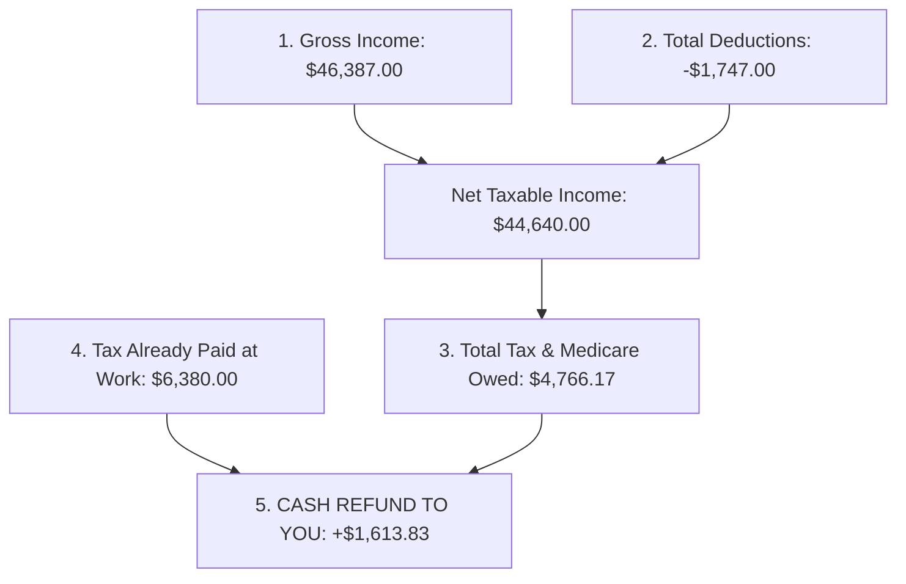

# 📊 Complete Tax Return & Refund Breakdown (FY 2025–2026)
**Taxpayer:** Wendy Kyungrim Park  
**Occupation:** Event Manager  
**Financial Year:** 1 July 2025 – 30 June 2026  
**Target Refund Account:** CBA MELBOURNE (`063-012` / `10958101`)  
**Final Estimated Refund:** 💵 **`+$1,613.83`**  

---

---

## 1️⃣ Part 1: Your Total Income Breakdown (`$46,387.00`)

This is all the income earned before tax during the 2025–2026 financial year, pre-filled directly from your employers and financial institutions:

| Income Source | Description / Role | Gross Income | Tax Already Paid (Withheld) |
| :--- | :--- | :---: | :---: |
| **Scape Australia Management Pty Ltd** | Salary & Wages (Scape Living Events/Operations) | $29,172.00 | $5,150.00 |
| **Experience Australia Group Pty Ltd** | Salary & Wages (Eureka Skydeck / Events) | $15,638.00 | $1,230.00 |
| **Bank Interest** | NAB ($1,334.85) + CBA ($149.37) + Up Bank 50% Share ($61.26) | $1,545.48 | $0.00 |
| **iShares S&P 500 ETF** | Managed Fund Distribution | $32.58 | $0.00 |
| **TOTAL GROSS INCOME** | | **`$46,387.00`** | **`$6,380.00`** |

> 📌 **Key Takeaway:** Your employers have already withheld **`$6,380.00`** in PAYG tax and paid it directly to the ATO on your behalf.

---

## 2️⃣ Part 2: Your Deductions Breakdown (`$1,747.00`)

Deductions reduce your taxable income so you don't pay income tax on money you spent to perform your role as an Event Manager:

| Deduction Category | Billed Amount in Bank Statements | Claim % | **Amount Claimed** | Exact Bank Statement Proof |
| :--- | :---: | :---: | :---: | :--- |
| **Self-Education: IELTS English Exam (D4)** | $475.00 | 100% | **`$475.00`** | `CommBank ...3266` ($475.00 on 01/01/2026) |
| **Work Mobile Phone: Belong (D5)** | $428.00 *(12 monthly bills)* | 85% | **`$363.80`** | `Up Bank ...481` ($35–$39/month) |
| **Home Internet: Pineapple Net (D5)** | $359.28 *(6 bills)* | 80% | **`$287.42`** | `Up Bank ...481` ($59.88/month) |
| **Home Office Energy: Origin Energy (D5)** | $682.84 *(9 bills)* | 40% | **`$273.14`** | `CommBank ...8101` (9 Direct Debits `ORIENE...`) |
| **Travel Expenses: Myki Fares (D2)** | $200.00 *(16 top-ups)* | 80% | **`$160.00`** | `CommBank` & `Up Bank` (16 top-ups) |
| **Work Uniform & Shirt Laundry (D3)** | Standard ATO Allowance | 100% | **`$150.00`** | ATO Tax Ruling TR 98/5 |
| **Cloud Storage: Apple.com (D5)** | $35.88 *(12 bills)* | 100% | **`$35.88`** | `Up Bank ...481` ($2.99/month) |
| **Work Supplies: Officeworks (D5)** | $1.49 | 100% | **`$1.49`** | `Up Bank ...481` on 16/11/2025 |
| **TOTAL DEDUCTIONS CLAIMED** | | | **`$1,747.00`** | *(Grouped into myTax categories)* |

---

## 3️⃣ Part 3: How the ATO Calculates Your Tax (The Math)

Here is the exact step-by-step mathematical calculation used by the ATO:

1. **Calculate Taxable Income:**  
   $$\text{Gross Income } (\$46,387.00) - \text{Total Deductions } (\$1,747.00) = \mathbf{\$44,640.00}$$

2. **Base Income Tax on $44,640.00:**  
   * The first **$18,200** is **$0.00 (Tax-Free)**.
   * The remaining **$26,440** ($44,640 − $18,200) is taxed at **16%**:  
     $$\$26,440 \times 0.16 = \mathbf{\$4,230.40}$$

3. **Medicare Levy (2.0% of Taxable Income):**  
   $$\$44,640.00 \times 0.02 = \mathbf{\$892.80}$$

4. **Minus ATO Tax Discounts (Offsets):**  
   * **Low Income Tax Offset (LITO):** **`-$353.20`** *(government tax relief for incomes below $66,667)*
   * **Foreign Income Tax Offset:** **`-$3.83`**

5. **Total Tax You Actually Owe for FY 2025–2026:**  
   $$\$4,230.40 + \$892.80 - \$353.20 - \$3.83 = \mathbf{\$4,766.17}$$

---

## 4️⃣ Part 4: Your Final Refund Equation

$$\begin{aligned}
\text{Total Tax Already Paid by Your Employers:} &\quad \mathbf{+\$6,380.00} \\
\text{Total Tax You Actually Owe the ATO:} &\quad \mathbf{-\$4,766.17} \\
\hline
\mathbf{\text{OVERPAID TAX REFUNDED TO YOU:}} &\quad \mathbf{\color{green}{+\$1,613.83}}
\end{aligned}$$

---

## 5️⃣ Part 5: Cash Value of Each Claimed Deduction

Because your income is in the **32% effective tax-saving bracket** (16% income tax + 2% Medicare + LITO phase-in), every deduction directly adds cash into your bank account:

| Claimed Item | Deduction Amount | Cash Directly Added to Your Refund |
| :--- | :---: | :---: |
| **IELTS English Exam** | $475.00 | **`+$152.00`** 💵 |
| **Mobile Phone (Belong)** | $363.80 | **`+$116.42`** 💵 |
| **Home Internet (Pineapple Net)** | $287.42 | **`+$91.97`** 💵 |
| **Home Energy (Origin Energy)** | $273.14 | **`+$87.40`** 💵 |
| **Myki Public Transport** | $160.00 | **`+$51.20`** 💵 |
| **Work Uniform Laundry** | $150.00 | **`+$48.00`** 💵 |
| **Apple Cloud & Supplies** | $37.37 | **`+$11.96`** 💵 |
| **TOTAL BENEFIT FROM DEDUCTIONS** | **$1,747.00** | **`+$558.95` EXTRA CASH!** |

---

## 6️⃣ Summary of What to Enter on myTax Right Now

* **Work-related self-education (D4):** Enter **`$475`**
* **Work-related travel expenses (D2):** Enter **`$160`**
* **Other work-related expenses (D5):** Enter **`$962`**
* **Clothing & laundry (D3):** Enter **`$150`**
* **Final Refund:** **`+$1,613.83`** deposited to **CBA Account `...8101`** within 7–14 days.
