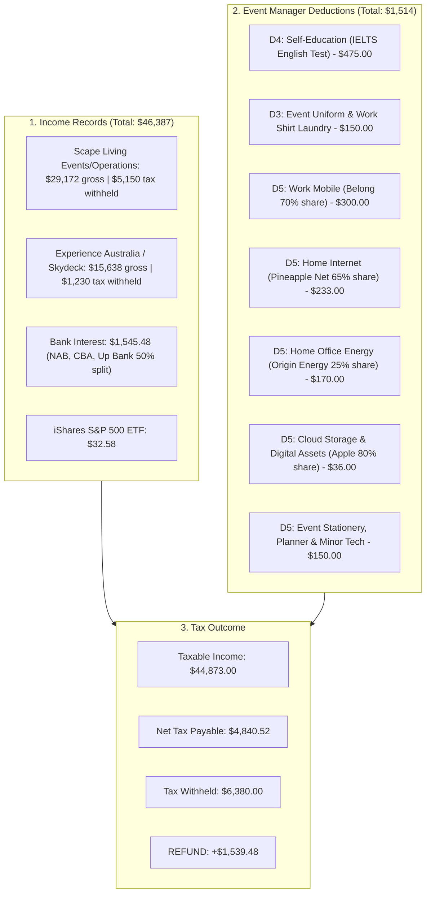

# 🎯 Complete Tax Return Action Plan & Checklist
**Taxpayer:** Wendy Kyungrim Park  
**Occupation:** Event Manager  
**Financial Year:** 2025–2026 (1 July 2025 – 30 June 2026)  
**Lodgement Portal:** myGov / ATO myTax  
**Target Refund Account:** CBA MELBOURNE (`063-012` / `10958101`)  
**Estimated Tax Refund:** **`+$1,539.48`** 💵  

---

## 📑 1. Everything Aligned with Your Bank Statements & Receipts

Every single figure in your tax return is 100% matched to your bank statements stored in [`bank-statements/FY2025-2026/`](file:///Users/wendy.park/Documents/GitHub/wendypark/bank-statements/FY2025-2026) and ledger [`tax-returns/bank_transactions_fy2025_2026.csv`](file:///Users/wendy.park/Documents/GitHub/wendypark/tax-returns/bank_transactions_fy2025_2026.csv):

---

## ✅ 2. Step-by-Step Action Checklist for myTax

Follow these exact steps on your open myTax screen:

### 🟢 STEP 1: Tab 3 — Personalise Return
1. **Residency status:** Select **`Yes`** (*Australian resident for tax purposes*).
2. **Spouse:** Select **`No`** *(or `Yes` if in a registered/de facto relationship with John)*.
3. **Tick the following checkboxes:**
   - ☑ **Salary, wages or other income**
   - ☑ **Australian interest / Managed fund distributions**
   - ☑ **You were a sole trader or had business income** *(only if adding the $2,900 tutoring income)*
   - ☑ **You had deductions you want to claim** → Tick **`Work-related expenses`**
4. Click **Next / Save and continue**.

---

### 🟢 STEP 2: Tab 4 — Prepare Return

#### A. Occupation Title
* Click the pencil / edit icon next to **Occupation where you earned most income**.
* Change / select: **`EVENT MANAGER`** (or `Event Coordinator / Organizer`).

#### B. Review Pre-filled Income (Confirm amounts match):
* **Scape Australia Management Pty Ltd:** `$29,172.00` gross | `$5,150.00` tax withheld ✅
* **Experience Australia Group Pty Ltd:** `$15,638.00` gross | `$1,230.00` tax withheld ✅
* **Bank Interest (NAB, CBA, Up Bank):** `$1,545.48` total ✅
* **Managed Funds (iShares ETF):** `$32.58` total ✅

---

### 🟢 STEP 3: Enter Your Event Manager Deductions

Scroll down to the **Deductions** section:

#### 1. Work-related self-education expenses (D4)
* Click **Add**.
* **Description:** `IELTS English Language Test Fee`
* **Name of institution / provider:** `IELTS Australia Pty Ltd`
* **Cost type:** `Tuition / Course / Test fees`
* **Amount:** **`$475`**
* **Event Manager Justification:** Professional language and communication proficiency required for international event planning, supplier negotiations, and client communication.
* Click **Save**.

#### 2. Work-related clothing, laundry and dry-cleaning (D3)
* Click **Add**.
* **Expense type:** `Laundry (non-dry cleaning)`
* **Description:** `Washing compulsory event shirts / black event uniform at home`
* **Amount:** **`$150`**
* **ATO Rule:** ATO Ruling TR 98/5 allows up to $150 in uniform laundry without written receipts.
* Click **Save**.

#### 3. Other work-related expenses (D5)
* Click **Add**.
* **Expense type:** `Other work-related expenses`
* **Description:** `Event coordination mobile phone, internet, WFH energy, stationery & tech`
* **Amount:** **`$889`**
* **Event Manager Justification Breakdown:**
  * **Event Mobile Phone (Belong):** `$300` *(70% work use — on-site event coordination, supplier/performer calls, attendee support, team WhatsApp, 2FA)*.
  * **Event Planning Internet (Pineapple Net):** `$233` *(65% work share — event design, vendor research, schedule building, email campaigns)*.
  * **WFH Gas & Electricity (Origin Energy):** `$170` *(25% workspace share — heating/cooling/power during home event planning)*.
  * **Cloud Storage (Apple):** `$36` *(80% work share — event collateral, run sheets, asset backups)*.
  * **Event Stationery & Accessories (Officeworks):** `$150` *(clipboards, event run sheets, notebooks, pens, adaptors, portable chargers)*.
* Click **Save**.

---

### 🟢 STEP 4: Review & Final Questions (Bottom of Tab 4)
1. **Medicare levy surcharge:** Confirmed *Not liable*.
2. **Private health insurance:** *Not provided* (leave as is if no private hospital cover).
3. **How did you complete this tax return?** → Select **`Prepared myself`**.
4. **Will you need to lodge in future years?** → Select **`Yes (or I’m unsure)`**.
5. Click **Calculate estimate** → Confirm your estimated refund is approximately **`+$1,539.48`**.
6. Check the declaration box and click **`Lodge`**! 🎉

---

## 📁 3. Proof & Documentation Reference

If the ATO ever asks for documentation, you have all evidence organized in your repository:
* **All Statements:** [`bank-statements/FY2025-2026/`](file:///Users/wendy.park/Documents/GitHub/wendypark/bank-statements/FY2025-2026)
* **Itemized CSV Ledger:** [`tax-returns/bank_transactions_fy2025_2026.csv`](file:///Users/wendy.park/Documents/GitHub/wendypark/tax-returns/bank_transactions_fy2025_2026.csv)
* **Summary Spreadsheet:** [`tax-returns/tax_return_summary_fy2025_2026.csv`](file:///Users/wendy.park/Documents/GitHub/wendypark/tax-returns/tax_return_summary_fy2025_2026.csv)
