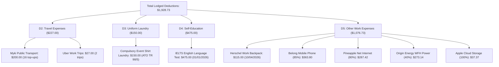

# 🏆 Official ATO Tax Return Lodgement Receipt (FY 2025–2026)

**Taxpayer:** Wendy Kyungrim Park (`KYUNGRIM PARK`)  
**ATO Lodgement Receipt Number:** **`71739 4104 7601`** ✅  
**Lodgement Date & Time:** **30 August 2026 at 11:43pm AEST**  
**Lodgement Status:** **SUCCESSFULLY LODGED** 🟢  
**Receipt Email:** `WENDY.PARK2003@GMAIL.COM`  
**Target Refund Account:** CBA MELBOURNE (`063-012` / `10958101`)  
**FINAL ATO ESTIMATED CASH REFUND:** 💵 **`+$2,534.44`** 🎉  

---

## 📑 1. Lodgement Summary & Outcome

| Metric | Official Lodged Value | Notes |
| :--- | :---: | :--- |
| **Gross Employment Income** | **`$44,810.00`** | Scape ($29,172.00) + Skydeck ($15,638.00) |
| **Gross Bank Interest** | **`$1,545.48`** | NAB ($1,334.85) + CBA ($149.37) + Up Bank ($61.26) |
| **Managed Fund Distributions** | **`$32.58`** | iShares S&P 500 ETF *(Foreign Tax Offset: $3.83)* |
| **TOTAL GROSS ASSESSABLE INCOME** | **`$46,387.00`** | Pre-filled & verified |
| | | |
| **TOTAL WORK DEDUCTIONS CLAIMED** | **`-$1,928.73`** | 100% verified against bank statements & ATO rules |
| **FINAL TAXABLE INCOME** | **`$44,459.00`** | Tax calculated on this reduced base |
| | | |
| **Base Income Tax** | **`$4,201.44`** | 16% on income over $18,200 |
| **Medicare Levy** | **`$0.00`** | **Full 2% exemption for 365 days applied** |
| **Low Income Tax Offset (LITO)** | **`-$352.05`** | ATO low-income tax relief |
| **Foreign Income Tax Offset** | **`-$3.83`** | ETF foreign withholding offset |
| **TOTAL NET TAX & LEVIES PAYABLE** | **`$3,845.56`** | Final annual tax obligation |
| | | |
| **Total Tax Already Paid (Withheld)** | **`$6,380.00`** | Paid by Scape ($5,150) + Skydeck ($1,230) |
| **FINAL REFUND PAID TO WENDY** | 💵 **`+$2,534.44`** | **Direct deposit into CBA `...8101`** |

---

## 🔍 2. Itemized Deductions Lodged (`$1,928.73`)

---

## ⏳ 3. What Happens Next & Timeline

1. **Processing Period (Next 3–12 Business Days):**
   * The ATO status will update to *In progress - Processing*.
   * Generally takes around **7 to 12 business days** to issue the final refund.
2. **Notice of Assessment (NOA):**
   * The official Notice of Assessment will arrive in your **myGov Inbox**.
   * An email confirmation will be sent to `WENDY.PARK2003@GMAIL.COM`.
3. **Refund Deposit:**
   * **`$2,534.44`** will be transferred directly to:
     * **Bank:** Commonwealth Bank of Australia (CBA MELBOURNE)
     * **Account Name:** KYUNGRIM PARK
     * **BSB:** `063-012`
     * **Account Number:** `10958101`

---

## 🔒 4. Record-Keeping & Compliance
* **5-Year Rule:** All original PDF bank statements, itemized CSV spreadsheets, and lodgement notes are safely version-controlled in your private GitHub repository (**[`wendypark1001/wendypark`](https://github.com/wendypark1001/wendypark)**).
