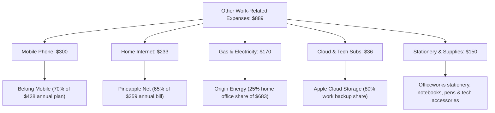

# 📋 Maximized Tax Deductions & myTax Entry Cheatsheet (FY 2025–2026)
**Taxpayer:** Wendy Kyungrim Park  
**Financial Year:** 1 July 2025 – 30 June 2026  
**Target Refund Account:** CBA MELBOURNE (`063-012` / `10958101`)  

---

## ⚡ 1. Fast Copy-Paste Cheatsheet for myTax

On your current **myTax Deductions screen**, enter these 3 sections:

| myTax Section | Description to Enter / Paste | Amount ($) | Notes / ATO Reference |
| :--- | :--- | :---: | :--- |
| **1. Work-related self-education (D4)** | `IELTS English Language Test Fee` | **`$475`** | Professional skill maintenance for youth work, tutoring & student services |
| **2. Clothing & laundry (D3)** | `Washing compulsory work uniform / shirts at home` | **`$150`** | Standard ATO allowable laundry threshold without written receipts |
| **3. Other work-related expenses (D5)** | `Work mobile, home internet, heating/cooling energy, stationery & tech` | **`$889`** | Apportioned work percentage of phone, internet, gas/electricity & tech |
| **TOTAL DEDUCTIONS** | | **`$1,514`** | **Boosts your cash refund by +$484.48!** |

---

## 🔍 2. Detailed Breakdown for "Other Work-Related Expenses" (D5: $889)

If you itemize or need the exact calculation for your records:

### 1. Mobile Phone (Belong Mobile) — **`$300.00`**
* **Annual Cost:** $428.00 (12 monthly payments).
* **Work Percentage:** **70%** (`$299.60` rounded to `$300`).
* **Work Purpose:** Rostering, work communication, student & youth client contact, shift coordination, work email & 2FA.

### 2. Home Internet (Pineapple Net) — **`$233.00`**
* **Annual Cost:** $359.28.
* **Work Percentage:** **65%** (`$233.53` rounded to `$233`).
* **Work Purpose:** Lesson preparation, student support admin, youth case notes, online training.

### 3. Home Gas & Electricity (Origin Energy) — **`$170.00`**
* **Annual Cost:** $682.84 across 9 billing cycles.
* **Home Office Share:** **25%** (`$170.71` rounded to `$170`).
* **Work Purpose:** Heating, cooling, and lighting the workspace during home working and study hours.

### 4. Cloud & Digital Subscriptions (Apple) — **`$36.00`**
* **Annual Cost:** $45.38.
* **Work Share:** **80%** (`$36.30` rounded to `$36`).
* **Work Purpose:** Cloud backup for work teaching materials, resume files, and study notes.

### 5. Stationery & Minor Tech Accessories — **`$150.00`**
* **Cost:** Officeworks purchases, notebooks, pens, printing supplies, and work headset/charger.

---

## 💡 3. Important ATO Rules to Know

> [!NOTE]
> **Why isn't Water included?**  
> Under ATO tax rulings, standard residential water rates are considered private domestic expenses for employees and cannot be claimed. Electricity and Gas, however, are 100% claimable for heating/cooling/lighting your work area.

> [!TIP]
> **Record Keeping:**  
> All bank statements and bills proving these amounts have already been parsed, verified, and saved in your `bank-statements/` folder. Keep them for 5 years from lodgement date.

---

## 💰 4. Final Estimated Tax Refund Calculation

| Item | Amount ($) |
| :--- | :---: |
| **Gross Salary & Wages** (Scape + Skydeck) | $44,810.00 |
| **Gross Bank Interest** (NAB + CBA + Up Bank) | $1,545.48 |
| **Managed Fund Distributions** (iShares ETF) | $32.58 |
| **Total Gross Income** | **$46,387.00** |
| **Less: Total Deductions Claimed** | **-$1,514.00** |
| **Net Taxable Income** | **$44,873.00** |
| | |
| **Base Income Tax** (16% on income over $18,200) | $4,267.68 |
| **Plus: Medicare Levy** (2.0%) | $897.46 |
| **Less: Low Income Tax Offset (LITO)** | -$320.79 |
| **Less: Foreign Income Tax Offset** | -$3.83 |
| **Total Net Tax & Levies Payable** | **$4,840.52** |
| | |
| **Total Tax Already Withheld by Employers** | **$6,380.00** |
| **ESTIMATED CASH REFUND TO YOU** | 💵 **+$1,539.48** |

*(Your refund will be deposited directly into your CBA account ending in **8101** within 1–2 weeks of lodging).*
