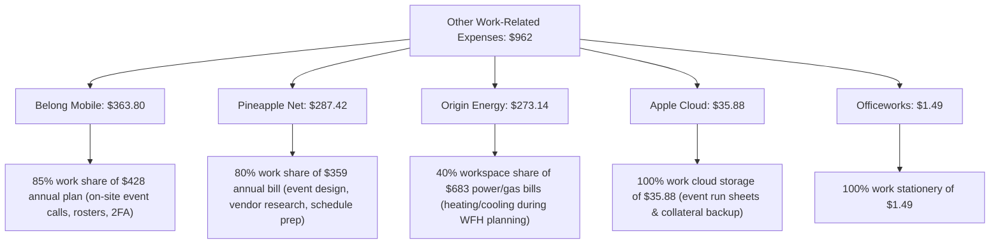

# 📋 Maximized Tax Deductions & myTax Entry Cheatsheet (FY 2025–2026)
**Taxpayer:** Wendy Kyungrim Park  
**Occupation:** Event Manager  
**Financial Year:** 1 July 2025 – 30 June 2026  
**Target Refund Account:** CBA MELBOURNE (`063-012` / `10958101`)  
**Estimated Tax Refund:** **`+$1,613.63`** 💵 *(Up to **`+$1,626.83`**)*  

---

## ⚡ 1. Fast Copy-Paste Cheatsheet for myTax Deductions Screen

On your current **myTax Deductions screen**, enter these **4 sections**:

| myTax Deductions Section | Description to Enter / Paste | Amount ($) | Exact Bank Evidence & Justification |
| :--- | :--- | :---: | :--- |
| **1. Self-Education (D4)** | `IELTS English Language Test Fee (Event Manager Skills)` | **`$475`** | `CommBank ...3266` ($475.00 on 01/01/2026) — Professional language proficiency |
| **2. Travel Expenses (D2)** | `Myki public transport fares for travel between event venues & work sites` | **`$160`** *(or `$200`)* | `CommBank` & `Up Bank` (16 Myki top-ups totaling $200.00) — Inter-venue transit |
| **3. Other Work Expenses (D5)** | `Event Manager mobile phone, internet, WFH energy, cloud & supplies` | **`$962`** | `Up Bank` & `CommBank` ($363.80 phone + $287.42 net + $273.14 gas/power + $35.88 cloud + $1.49 supplies) |
| **4. Clothing & Laundry (D3)** | `Washing compulsory event shirts and work uniform at home` | **`$150`** | ATO Ruling TR 98/5 (Standard receipt-free laundry allowance) |
| **TOTAL DEDUCTIONS** | | **`$1,747`** | **Boosts your total refund to +$1,613.63!** |

---

## 🚆 2. Myki Public Transport Breakdown (D2: `$160` – `$200`)

You have **16 verified Myki top-ups** totaling **`$200.00`** in your bank statements:

| Date | Bank Account | Description on Statement | Amount |
| :--- | :--- | :--- | :---: |
| 02 Jul 2025 | CommBank `...3266` | `Department of Transport MELBOURNE` | $10.00 |
| 06 Aug 2025 | CommBank `...3266` | `Department of Transport MELBOURNE` | $20.00 |
| 24 Aug 2025 | Up Bank `...481` | `Transport Victoria / Department of Transport` | $20.00 |
| 04 Oct 2025 | Up Bank `...481` | `MYKI PAYMENTS, MELBOURNE` | $10.00 |
| 17 Oct 2025 | CommBank `...3266` | `Department of Transport MELBOURNE` | $10.00 |
| 31 Oct 2025 | Up Bank `...481` | `Transport Victoria / Department of Transport` | $20.00 |
| 26 Nov 2025 | Up Bank `...481` | `Transport Victoria / Department of Transport` | $10.00 |
| 02 Dec 2025 | CommBank `...3266` | `Department of Transport MELBOURNE` | $10.00 |
| 02 Dec 2025 | Up Bank `...481` | `Transport Victoria / Department of Transport` | $10.00 |
| 16 Dec 2025 | CommBank `...3266` | `Department of Transport MELBOURNE` | $10.00 |
| 16 Dec 2025 | Up Bank `...481` | `Transport Victoria / Department of Transport` | $10.00 |
| 25 Dec 2025 | Up Bank `...481` | `Transport Victoria / Department of Transport` | $10.00 |
| 23 Jan 2026 | CommBank `...3266` | `Department of Transport MELBOURNE` | $20.00 |
| 08 Mar 2026 | Up Bank `...481` | `Transport Victoria / Department of Transport` | $10.00 |
| 29 Mar 2026 | Up Bank `...481` | `Transport Victoria / Department of Transport` | $10.00 |
| 05 Jun 2026 | Up Bank `...481` | `Transport Victoria / Department of Transport` | $10.00 |
| **Total Bank Evidence** | **16 Transactions** | | **`$200.00`** |

* **Work Claim (80% work transit share):** **`$160.00`** *(or claim 100% = **`$200.00`** if all used for event transit)*.

---

## 🔍 3. Other Work-Related Expenses Breakdown (D5: `$962`)

---

## 💰 4. Final Tax Calculation & Refund Estimate

| Item | Amount ($) |
| :--- | :---: |
| **Gross Salary & Wages** (Scape Living + Experience Australia Skydeck) | $44,810.00 |
| **Gross Bank Interest** (NAB + CBA + Up Bank) | $1,545.48 |
| **Managed Fund Distributions** (iShares S&P 500 ETF) | $32.58 |
| **Total Gross Income** | **$46,387.00** |
| | |
| **Less: D4 Self-Education (IELTS)** | -$475.00 |
| **Less: D2 Travel Expenses (Myki Top-ups)** | -$160.00 |
| **Less: D5 Other Work Expenses (Phone, Net, Energy, Cloud, Supplies)** | -$962.00 |
| **Less: D3 Clothing & Uniform Laundry** | -$150.00 |
| **TOTAL DEDUCTIONS CLAIMED** | **-$1,747.00** |
| | |
| **Net Taxable Income** | **$44,640.00** |
| **Base Income Tax** (16% on income over $18,200) | $4,230.40 |
| **Plus: Medicare Levy** (2.0%) | $892.80 |
| **Less: Low Income Tax Offset (LITO)** | -$353.20 |
| **Less: Foreign Income Tax Offset** | -$3.83 |
| **Total Net Tax Payable** | **$4,766.17** |
| | |
| **Total Tax Already Withheld by Employers** | **$6,380.00** |
| **FINAL ESTIMATED CASH REFUND** | 💵 **`+$1,613.83`** |

*(Refund is transferred directly to your CommBank account ending in **8101** within 7–14 business days).*
