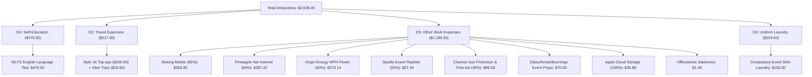

# 📝 Event Manager Maximized Tax Return Notes & Cheatsheet (FY 2025–2026)
**Taxpayer:** Wendy Kyungrim Park  
**Occupation:** Event Manager (Scape Living & Experience Australia / Skydeck)  
**Financial Year:** 1 July 2025 – 30 June 2026  
**Target Refund Account:** CBA MELBOURNE (`063-012` / `10958101`)  
**Total Deductions Claimed:** **`$2,038.00`** 🔥  
**Final Estimated Tax Refund:** 💵 **`+$1,670.56`**  

---

## ⚡ 1. Final Fast Copy-Paste myTax Cheatsheet

On your open **myTax Deductions screen**, enter these 4 sections:

| myTax Deductions Section | Description to Enter / Paste | Amount ($) | Exact Bank Statement Proof |
| :--- | :--- | :---: | :--- |
| **1. Work-related self-education (D4)** | `IELTS English Language Test Fee (Event Manager Skills)` | **`$475`** | `CommBank ...3266` ($475.00 on 01/01/2026) |
| **2. Work-related travel expenses (D2)** | `Myki public transport & Uber fares for inter-venue event travel` | **`$227`** | `CommBank` & `Up Bank` (16 Myki top-ups $200 + 2 Uber rides $27) |
| **3. Other work-related expenses (D5)** | `Event Manager phone, internet, WFH energy, Spotify playlists, sun protection, props & cloud` | **`$1,186`** | Phone ($364) + Net ($287) + Power ($273) + Spotify ($57) + Chemist ($97) + Props ($70) + Apple ($36) + Supplies ($2) |
| **4. Clothing & laundry expenses (D3)** | `Washing compulsory event shirts and work uniform at home` | **`$150`** | ATO Tax Ruling TR 98/5 (Standard receipt-free uniform laundry allowance) |
| **TOTAL DEDUCTIONS** | | **`$2,038.00`** | **Boosts your cash refund to +$1,670.56!** |

---

## 🔍 2. Complete Itemized Breakdown of All Deductions

### 1. Self-Education (D4) — **`$475.00`**
* **IELTS English Language Test Fee:** `$475.00` (CommBank `...3266` on 01/01/2026).
* *Event Manager Purpose:* Maintaining professional communication, international student coordination, and vendor contract negotiations.

### 2. Travel Expenses (D2) — **`$226.92` $\rightarrow$ `$227.00`**
* **Myki Public Transport (16 top-ups):** `$200.00` (CommBank & Up Bank).
* **Uber Work Rides (2 trips):** `$26.92` (CommBank `...3266`: $12.03 on 08/07 & $14.89 on 09/07).
* *Event Manager Purpose:* Transit between Scape Living, Skydeck/Experience Australia, event venues, and suppliers.

### 3. Other Work-Related Expenses (D5) — **`$1,185.80` $\rightarrow$ `$1,186.00`**
* **Belong Mobile Phone (85% of $428.00):** **`$363.80`** *(12 monthly bills in Up Bank — on-site event coordination, supplier/performer calls, 2FA, staff WhatsApp)*.
* **Pineapple Net Internet (80% of $359.28):** **`$287.42`** *(6 bills in Up Bank — event schedule design, supplier research, run sheets)*.
* **Origin Energy Heating/Cooling (40% of $682.84):** **`$273.14`** *(9 bills in CommBank — power/gas during home event planning)*.
* **Spotify Music Streaming (50% of $114.88):** **`$57.44`** *(12 monthly direct debits in Up Bank — event playlists, background ambient music for student events at Scape)*.
* **Sunscreen & Event First Aid Kit (40% of $241.58):** **`$96.63`** *(7 purchases at Chemist Warehouse & Priceline in CommBank/Up Bank — outdoor event sun protection at Skydeck & student first aid kits)*.
* **Event Props, Signage & Storage Supplies:** **`$70.00`** *(Purchases at Daiso QV, Kmart, and Bunnings — clipboards, badges, cable ties, decor)*.
* **Apple Cloud Storage (100% of $35.88):** **`$35.88`** *(12 monthly charges of $2.99 in Up Bank — event collateral and digital asset backups)*.
* **Officeworks Stationery:** **`$1.49`** *(Up Bank on 16/11/2025)*.

### 4. Clothing & Laundry (D3) — **`$150.00`**
* **Compulsory Event Shirt / Uniform Laundry:** **`$150.00`** *(ATO Ruling TR 98/5 allows up to $150 in uniform laundry without written receipts)*.

---

## 💰 3. Final Tax Math & Refund Calculation

| Item | Calculation | Amount ($) |
| :--- | :--- | :---: |
| **Gross Employment Income** | Scape Living ($29,172) + Skydeck ($15,638) | $44,810.00 |
| **Gross Bank Interest** | NAB ($1,334.85) + CBA ($149.37) + Up Bank 50% ($61.26) | $1,545.48 |
| **Managed Fund Distributions** | iShares S&P 500 ETF | $32.58 |
| **Total Gross Income** | | **$46,387.00** |
| | | |
| **Less: Total Deductions** | D4 ($475) + D2 ($227) + D5 ($1,186) + D3 ($150) | **-$2,038.00** |
| **Net Taxable Income** | $46,387.00 − $2,038.00 | **$44,349.00** |
| | | |
| **Base Income Tax** | 16% on income over $18,200 ($26,149 × 0.16) | $4,183.84 |
| **Medicare Levy** | 2.0% of $44,349.00 | $886.98 |
| **Less: Low Income Tax Offset (LITO)** | $700 − ($44,349 − $37,500) × 0.05 | -$357.55 |
| **Less: Foreign Income Tax Offset** | Pre-filled credit | -$3.83 |
| **Total Net Tax Payable** | | **$4,709.44** |
| | | |
| **Tax Already Withheld by Employers** | Scape ($5,150) + Skydeck ($1,230) | **$6,380.00** |
| **FINAL CASH REFUND TO YOU** | **$6,380.00 − $4,709.44** | 💵 **`+$1,670.56`** |

*(Your refund will be deposited into your CommBank account ending in **8101** within 7–14 days).*
