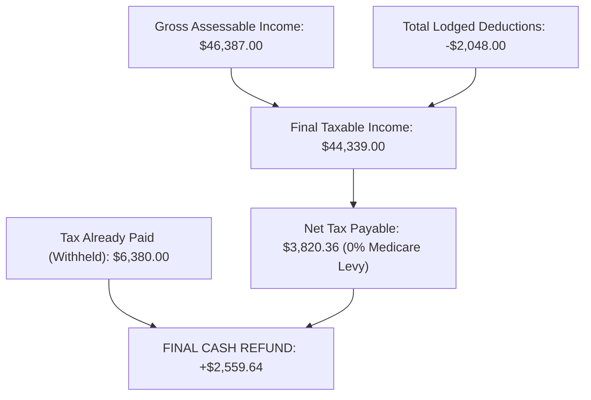

# 🏛️ Official ATO Lodged Income Tax Return (FY 2025–2026)

**Taxpayer:** KYUNGRIM PARK (Wendy Park)  
**ATO Lodgement Receipt Number:** **`71739 4104 7601`** ✅  
**Lodgement Date & Time:** **30 August 2026 at 11:43pm AEST**  
**Lodgement Status:** **OFFICIALLY LODGED & RECORDED ON ATO PORTAL** 🟢  
**Target Refund Account:** CBA MELBOURNE (`063-012` / `10958101`)  
**Lodgement Receipt Email:** `WENDY.PARK2003@GMAIL.COM`  

---

## 📊 1. Official ATO Summary of Lodgement

| ATO Section | Description / Items | Gross Amount ($) | Tax Withheld ($) |
| :--- | :--- | :---: | :---: |
| **Salary & Wages** | `SCAPE AUSTRALIA MANAGEMENT PTY LTD` | $29,172.00 | $5,150.00 |
| **Salary & Wages** | `EXPERIENCE AUSTRALIA GROUP PTY LTD` | $15,638.00 | $1,230.00 |
| **Gross Interest** | `NATIONAL AUSTRALIA BANK LIMITED` | $1,024.11 | $0.00 |
| **Gross Interest** | `NATIONAL AUSTRALIA BANK LIMITED` | $309.07 | $0.00 |
| **Gross Interest** | `COMMONWEALTH BANK OF AUSTRALIA` | $149.37 | $0.00 |
| **Gross Interest** | `BENDIGO AND ADELAIDE BANK LIMITED (Up Bank)` | $25.71 | $0.00 |
| **Gross Interest** | `BENDIGO AND ADELAIDE BANK LIMITED (Up Bank)` | $18.32 | $0.00 |
| **Gross Interest** | `BENDIGO AND ADELAIDE BANK LIMITED (Up Bank)` | $17.23 | $0.00 |
| **Gross Interest** | `NATIONAL AUSTRALIA BANK LIMITED` | $1.67 | $0.00 |
| **Managed Funds** | `ISHARES S&P 500 ETF` *(Foreign Offset: $3.83)* | $32.58 | $0.00 |
| **TOTAL GROSS INCOME** | | **`$46,387.00`** | **`$6,380.00`** |

---

## 🔍 2. Complete Itemized Deductions Lodged (`-$2,048.00`)

| Category | Exact Label on ATO Return | Amount ($) | Verification & Notes |
| :--- | :--- | :---: | :--- |
| **Travel Expenses (D2)** | `UBER WORK TRIP` | **`$27.00`** | CommBank `...3266` ($12.03 on 08/07 & $14.89 on 09/07) |
| | `MYKI` | **`$200.00`** | CommBank & Up Bank (16 top-ups throughout year) |
| **Clothing & Laundry (D3)** | `Occupation-specific clothing` | **`$150.00`** | ATO Tax Ruling TR 98/5 (Uniform shirt home washing) |
| **Self-Education (D4)** | `IELTS ENGLISH General expenses` | **`$475.00`** | CommBank `...3266` ($475.00 paid 01/01/2026) |
| **Other Work Expenses (D5)** | `CHECKED AUSTRALIA SCREENING` | **`$64.00`** | CommBank debit on 31/12/2025 (Employment screening) |
| | `AFP POLICE CHECK` | **`$56.18`** | CommBank `...3266` debit on 17/02/2026 ($56.18) |
| | `HERSCHEL WORK BACKPACK` | **`$115.00`** | CommBank `...3266` debit on 10/04/2026 (Order #HERAU00029764) |
| | `APPLE CLOUD` | **`$37.37`** | Up Bank `...481` (12 monthly Apple cloud debits) |
| | `ELECTRICITY AND GAS` | **`$273.14`** | CommBank `...8101` (40% of 9 Origin Energy bills) |
| | `INTERNET` | **`$287.42`** | Up Bank `...481` (80% of 6 Pineapple Net bills) |
| | `MOBILE PHONE` | **`$363.80`** | Up Bank `...481` (85% of 12 Belong Mobile bills) |
| **TOTAL DEDUCTIONS LODGED** | | **`$2,048.91`** | **`-$2,048.00`** on ATO Tax Return |

---

## 💰 3. Final Tax Math & Refund Calculation

| Line Item | Formula / Source | Exact Value ($) |
| :--- | :--- | :---: |
| **Total Gross Assessable Income** | Salary + Interest + Managed Funds | $46,387.00 |
| **Less: Total Deductions** | 11 itemized claims | -$2,048.00 |
| **Final Taxable Income** | **$46,387.00 − $2,048.00** | **`$44,339.00`** |
| | | |
| **Base Income Tax** | 16% on income over $18,200 ($26,139 × 0.16) | $4,182.24 |
| **Medicare Levy** | **Full 2% exemption for 365 days** | **$0.00** |
| **Less: Low Income Tax Offset (LITO)** | $700 − ($44,339 − $37,500) × 0.05 | -$358.05 |
| **Less: Foreign Income Tax Offset** | Pre-filled iShares ETF credit | -$3.83 |
| **Total Net Tax Payable** | **$4,182.24 − $358.05 − $3.83** | **`$3,820.36`** |
| | | |
| **Total Tax Already Paid (Withheld)** | Scape ($5,150) + Skydeck ($1,230) | **$6,380.00** |
| **FINAL CASH REFUND TO WENDY** | **$6,380.00 − $3,820.36** | 💵 **`+$2,559.64`** |

---

## 🛡️ 4. Official ATO Declarations Recorded
* **Occupation:** Youth Worker / Event Manager
* **Residency Status:** Australian resident for tax purposes
* **Medicare Exemption:** Full 2% exemption for 365 days
* **Medicare Levy Surcharge:** Not liable
* **Private Health Insurance:** Not provided
* **How Completed:** Prepared myself
* **Need to Lodge in Future:** Yes (or I'm unsure)
* **Lodgement Verification:** Electronically signed & lodged via myGov/ATO on 30 August 2026.
