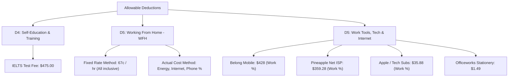

# 📑 Tax Return Preparation Pack (FY 2025–2026)
**Taxpayer:** Wendy Kyungrim Park  
**Financial Year:** 1 July 2025 – 30 June 2026 (with FY 2024–2025 prior period reference)  
**Jurisdiction:** Australian Taxation Office (ATO) / myTax  

---

## 1. Executive Summary & Overview

Based on the analysis of all your CommBank and Up Bank financial records, here is your consolidated tax return preparation summary for the **2025–2026 Australian Financial Year**:

| Tax Item | Category / Source | Transaction Count | Total Bank Cash Amount | Tax Treatment & Notes |
| :--- | :--- | :---: | :---: | :--- |
| **Item 1** | **Salary & Wages (PAYG)** | **31 pays** | **$38,718.53** *(net)* | Gross wages & PAYG tax withheld pre-fill from myGov/ATO Income Statements |
| | ↳ *Scape Swanston Operations* | 12 pays | $24,310.35 | Jan 2026 – Jun 2026 (Fortnightly) |
| | ↳ *Experience Australia Group* | 19 pays | $14,408.18 | Sep 2025 – Jun 2026 (Fortnightly) |
| **Item 15** | **Sole Trader / Tutoring Income** | **16 payments** | **$2,750.00** | Declare as business / other personal services income |
| | ↳ *Mrs Sun Hee Yoo (Alice)* | 8 payments | $1,500.00 | $150 – $250 / session |
| | ↳ *Chortip Khuttiyanont (Opal)* | 8 payments | $1,250.00 | $50 – $250 / session |
| **Item 10** | **Gross Interest Earned** | **35 credits** | **$121.83** *(Total)*   **$60.91** *(50% Share)* | Up Bank 2Up Joint Account (shared with John Minseok Kim) |
| **D1–D5** | **Work-Related Deductions** | **Various** | **$1,947.50+** *(Gross)* | Claims subject to work-use percentage & method selection |
| | ↳ *D4: Self-Education (IELTS)* | 1 | $475.00 | Professional / occupational English test |
| | ↳ *D5: WFH Energy (Origin)* | 9 bills | $682.84 | Claim via Fixed Rate (67c/hr) or Actual Cost % |
| | ↳ *D5: Home Internet (Pineapple)* | 6 bills | $359.28 | Claim work-related % |
| | ↳ *D5: Mobile Phone (Belong)* | 12 bills | $428.00 | Claim work-related % |
| | ↳ *D5: Subscriptions & Tech* | 12 charges | $35.88 | Apple / cloud storage work usage |
| | ↳ *D5: Stationery / Supplies* | 1 purchase | $1.49 | Officeworks |

---

## 2. Detailed Income Breakdown

### A. Salary & Wages (Employment Income)

> [!NOTE]
> The figures below represent **net cash deposits** into your account. When lodging in **myTax**, your employers report the **Gross Salary** and **Tax Withheld (PAYG)** directly to the ATO via Single Touch Payroll (STP). Check your myGov Income Statement to confirm they match.

#### 1. Scape Swanston Operations Pty Ltd (Scape Living)
*Account: CommBank `06 3012 10958101`*

| Date | Description | Net Deposit ($) |
| :--- | :--- | :---: |
| 22 Jan 2026 | `Salary Scape Swanston O Payroll` | $1,156.38 |
| 05 Feb 2026 | `Salary Scape Swanston O Payroll` | $2,078.77 |
| 19 Feb 2026 | `Salary Scape Swanston O Payroll` | $2,078.77 |
| 05 Mar 2026 | `Salary Scape Swanston O Payroll` | $2,078.77 |
| 19 Mar 2026 | `Salary Scape Swanston O Payroll` | $2,078.77 |
| 02 Apr 2026 | `Salary Scape Swanston O Payroll` | $2,078.77 |
| 16 Apr 2026 | `Salary Scape Swanston O Payroll` | $2,078.77 |
| 30 Apr 2026 | `Salary Scape Swanston O Payroll` | $2,078.77 |
| 14 May 2026 | `Salary Scape Swanston O Payroll` | $2,078.77 |
| 28 May 2026 | `Salary Scape Swanston O Payroll` | $2,078.77 |
| 11 Jun 2026 | `Salary Scape Swanston O Payroll` | $2,078.77 |
| 25 Jun 2026 | `Salary Scape Swanston O Payroll` | $2,366.27 |
| **Subtotal** | **12 Pay Cycles** | **$24,310.35** |

---

#### 2. Experience Australia Group Pty Ltd (Skydeck / SKD Wages)
*Account: CommBank `06 3012 10958101`*

| Date | Description | Net Deposit ($) |
| :--- | :--- | :---: |
| 10 Sep 2025 | `Salary EXPERIENCE AUSTR SKD WAGES 30007432` | $861.57 |
| 24 Sep 2025 | `Salary EXPERIENCE AUSTR SKD WAGES 30007432` | $1,164.10 |
| 08 Oct 2025 | `Salary EXPERIENCE AUSTR SKD WAGES 30007432` | $1,430.24 |
| 23 Oct 2025 | `Salary EXPERIENCE AUSTR SKD WAGES 30007432` | $1,461.80 |
| 05 Nov 2025 | `Salary EXPERIENCE AUSTR SKD WAGES 30007432` | $1,447.99 |
| 19 Nov 2025 | `Salary EXPERIENCE AUSTR SKD WAGES 30007432` | $1,284.16 |
| 03 Dec 2025 | `Salary EXPERIENCE AUSTR SKD WAGES 30007432` | $1,147.88 |
| 17 Dec 2025 | `Salary EXPERIENCE AUSTR SKD WAGES 30007432` | $963.70 |
| 31 Dec 2025 | `Salary EXPERIENCE AUSTR SKD WAGES 30007432` | $1,280.17 |
| 14 Jan 2026 | `Salary EXPERIENCE AUSTR SKD WAGES 30007432` | $1,170.59 |
| 28 Jan 2026 | `Salary EXPERIENCE AUSTR SKD WAGES 30007432` | $160.60 |
| 11 Feb 2026 | `Salary EXPERIENCE AUSTR SKD WAGES 30007432` | $177.50 |
| 11 Mar 2026 | `Salary EXPERIENCE AUSTR SKD WAGES 30007432` | $344.18 |
| 25 Mar 2026 | `Salary EXPERIENCE AUSTR SKD WAGES 30007432` | $180.21 |
| 08 Apr 2026 | `Salary EXPERIENCE AUSTR SKD WAGES 30007432` | $160.60 |
| 22 Apr 2026 | `Salary EXPERIENCE AUSTR SKD WAGES 30007432` | $321.20 |
| 20 May 2026 | `Salary EXPERIENCE AUSTR SKD WAGES 30007432` | $369.65 |
| 03 Jun 2026 | `Salary EXPERIENCE AUSTR SKD WAGES 30007432` | $255.84 |
| 17 Jun 2026 | `Salary EXPERIENCE AUSTR SKD WAGES 30007432` | $226.20 |
| **Subtotal** | **19 Pay Cycles** | **$14,408.18** |

---

### B. Tutoring / Freelance Income (Sole Trader / PSI)
*Account: CommBank `06 5004 11273266`*

| Date | Client / Description | Memo / Reference | Amount ($) |
| :--- | :--- | :--- | :---: |
| 17 Jul 2025 | Chortip Khuttiyanont | `Opal Eng` | $50.00 |
| 23 Jul 2025 | Mrs Sun Hee Yoo | `Alice English` | $150.00 |
| 30 Jul 2025 | Chortip Khuttiyanont | `Opal Eng` | $50.00 |
| 04 Aug 2025 | Chortip Khuttiyanont | `Opal 23rd July, 4th Aug` | $100.00 |
| 27 Aug 2025 | Chortip Khuttiyanont | `opal Aug` | $150.00 |
| 27 Aug 2025 | Mrs Sun Hee Yoo | `Alice English` | $200.00 |
| 30 Sep 2025 | Mrs Sun Hee Yoo | `Alice English` | $250.00 |
| 30 Sep 2025 | Chortip Khuttiyanont | `Opal Eng` | $250.00 |
| 03 Nov 2025 | Mrs Sun Hee Yoo | `Alice English` | $200.00 |
| 08 Dec 2025 | Mrs Sun Hee Yoo | `Alice English` | $150.00 |
| 08 Dec 2025 | Chortip Khuttiyanont | `Opal Eng` | $200.00 |
| 07 Jan 2026 | Mrs Sun Hee Yoo | `Alice English` | $150.00 |
| 07 Jan 2026 | Chortip Khuttiyanont | `Opal Eng` | $200.00 |
| 01 Feb 2026 | Chortip Khuttiyanont | `opal Eng` | $200.00 |
| 01 Feb 2026 | Mrs Sun Hee Yoo | `Alice English` | $200.00 |
| 06 Mar 2026 | Mrs Sun Hee Yoo | `Alice English` | $250.00 |
| **Total** | **Tutoring / Sole Trader Income** | | **$2,750.00** |

---

### C. Bank Interest Income (Item 10)
*Account: Up Bank 2Up Joint Account `221430481` (Bendigo and Adelaide Bank)*

* Total Interest Credited across Savers & Spending in FY 2025–2026: **$121.83**
* **Wendy's 50% Share:** **$60.91** *(John Minseok Kim declares the other 50% = $60.92)*

---

## 3. Allowable Tax Deductions & Work-Related Expenses

### 1. D4: Self-Education / Professional Accreditation
- **Item:** IELTS Australia Exam Fee
- **Date:** 30 Dec 2025 / 01 Jan 2026
- **Amount:** **$475.00**
- **Deductibility Criterion:** Deductible if the test maintains or improves skills required in your current role (e.g. teaching, tutoring, student accommodation coordination) or was required by your employer.

---

### 2. D5: Working From Home (WFH) & Operating Expenses

You have two choices for claiming home office / WFH expenses:

#### Option A: ATO Revised Fixed Rate Method (67 cents / hour) — *Recommended*
* **Rate:** $0.67 per hour worked from home.
* **Covers:** Electricity, gas, home internet, mobile phone usage, stationery, and computer consumables.
* **Advantage:** No need to apportion utility bills; only requires a record of actual hours worked from home (e.g. timesheets, roster, or a 4-week representative diary).
* **Additional claims allowed:** Depreciation / decline in value of tech assets (laptops, monitors, office chairs) over $300.

#### Option B: Actual Cost Method
If claiming actual expenses, you apportion work-use percentages:
1. **Origin Energy Bills (9 bills):** $682.84 total
   - *Example (20% work share):* **$136.57**
2. **Pineapple Net Home Internet (6 bills):** $359.28 total
   - *Example (50% work share):* **$179.64**
3. **Belong Mobile Phone (12 bills):** $428.00 total
   - *Example (50% work share):* **$214.00**
4. **Apple Subscriptions / Cloud:** $35.88 total
5. **Officeworks Stationery:** $1.49 total

---

## 4. Step-by-Step myTax Lodgement Guide

1. **Log in to myGov** and navigate to the **Australian Taxation Office (ATO)** section.
2. Select **Prepare Tax Return 2025–2026**.
3. **Step 1: Contact Details & Financial Institution Details**
   - Confirm your BSB & Account Number (e.g. your CommBank or Up Bank account for tax refunds).
4. **Step 2: Income**
   - **Salary & Wages:** Ensure `Scape Swanston Operations Pty Ltd` and `Experience Australia Group Pty Ltd` income statements show "Tax ready". Verify gross amounts against your payslips.
   - **Interest (Item 10):** Enter Up Bank interest. Declare **$60.91** (your 50% joint share) with 1 joint account holder.
   - **Business / Sole Trader Income (Item 15):** Enter Tutoring Income of **$2,750.00** under *Personal Services Income (PSI)* or *Business Income*.
5. **Step 3: Deductions**
   - **D4 (Self-education):** Enter $475.00 for IELTS test if eligible.
   - **D5 (Other work-related expenses):** Enter your WFH claim (Hours × $0.67/hr) or itemized phone/internet expenses.
6. **Step 4: Medicare & Private Health**
   - Confirm your Medicare levy / surcharge status.
7. **Review Tax Estimate & Submit**.

---

## 5. Prior Year (FY 2024–2025) Quick Reference

For any amendments or cross-checking prior year records:
* **Employer:** University of Melbourne (3 pays in H2: $2,289.06 net).
* **Tutoring Income:** 26 payments totaling $1,450.00 in H2.
* **Supplies & Tech:** Officeworks ($11.30) and Apple ($2.99).
